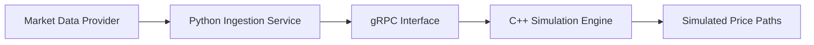

# Monte Carlo Stock Simulation Platform

A service-based stock simulation platform that combines a high-performance C++
Monte Carlo engine with a Python market-data ingestion service.

The Python service retrieves and preprocesses historical market data, then
communicates with the C++ simulation engine through gRPC and Protocol Buffers.
The C++ component uses Geometric Brownian Motion to generate probabilistic
stock-price paths from the supplied market parameters.

> **Status:** Active development. The C++ simulation engine, Python data
> ingestion workflow, and gRPC service boundary form the current core of the
> platform. Testing, visualization, and expanded model support remain in
> development.

## Table of Contents

- [Overview](#overview)
- [Architecture](#architecture)
- [Data Flow](#data-flow)
- [Current Capabilities](#current-capabilities)
- [Technology Stack](#technology-stack)
- [Simulation Model](#simulation-model)
- [Service Communication](#service-communication)
- [Engineering Decisions](#engineering-decisions)
- [Local Development](#local-development)
- [Testing](#testing)
- [Current Limitations](#current-limitations)
- [Roadmap](#roadmap)

## Overview

Monte Carlo simulation estimates a range of possible future outcomes by
repeatedly sampling random values from a mathematical model.

This platform divides the simulation workflow between two components:

- A **Python data-ingestion service** retrieves and preprocesses historical
  market data.
- A **C++ computational engine** performs Monte Carlo simulations using
  Geometric Brownian Motion.

The components exchange structured data through gRPC interfaces defined using
Protocol Buffers.

This design keeps external data acquisition separate from computationally
intensive simulation logic and allows each component to use the language best
suited to its responsibility.

## Architecture



## Data Flow

1. The Python service retrieves historical stock-price data.
2. The service cleans and preprocesses the retrieved observations.
3. Model parameters are derived from the historical data.
4. A structured gRPC request is sent to the C++ simulation engine.
5. The C++ engine generates multiple possible stock-price paths.
6. Simulation results are serialized using Protocol Buffers.
7. The generated paths are returned for analysis or visualization.

## Current Capabilities

- Historical market-data retrieval through Python
- Preprocessing of historical price observations
- Cross-language communication using gRPC
- Protocol Buffer schemas for simulation requests and responses
- C++ implementation of Geometric Brownian Motion
- Generation of multiple probabilistic stock-price paths
- Separation of data-ingestion and computational responsibilities
- Structured serialization of simulation parameters and results
- Service-layer interfaces for exchanging generated price paths

## Technology Stack

| Category | Technology |
|---|---|
| Computational engine | C++ |
| Data ingestion | Python |
| Communication | gRPC |
| Serialization | Protocol Buffers |
| Mathematical model | Geometric Brownian Motion |
| Market data | Historical stock-price data |
| Development tools | Git, Linux, Bash |

## Simulation Model

The current engine models stock prices using Geometric Brownian Motion.

For a time step $\Delta t$, the simulated price is calculated using:

$$
S_{t+\Delta t}
=
S_t
\exp\left(
\left(\mu - \frac{1}{2}\sigma^2\right)\Delta t
+
\sigma\sqrt{\Delta t}Z
\right)
$$

Where:

| Symbol | Meaning |
|---|---|
| $S_t$ | Stock price at time $t$ |
| $\mu$ | Estimated drift or expected return |
| $\sigma$ | Estimated volatility |
| $\Delta t$ | Size of the simulation time step |
| $Z$ | Random value sampled from a standard normal distribution |

The calculation is repeated across multiple time steps and simulation paths to
produce a distribution of potential outcomes.

## Service Communication

### Python ingestion service

The Python component is responsible for:

- Retrieving historical price observations
- Validating the returned market data
- Preprocessing time-series values
- Preparing model parameters
- Creating gRPC requests
- Receiving simulation responses

### C++ simulation engine

The C++ component is responsible for:

- Receiving structured simulation parameters
- Executing the Geometric Brownian Motion model
- Generating random price paths
- Organizing simulation results
- Returning serialized responses through gRPC

### Protocol Buffers

Protocol Buffers define the contract between the Python and C++ components.

The schemas represent information such as:

- Initial stock price
- Drift
- Volatility
- Simulation time horizon
- Number of time steps
- Number of simulation paths
- Generated price-path values

This contract allows the services to evolve independently while preserving a
consistent cross-language interface.

## Engineering Decisions

### C++ for numerical computation

C++ provides direct control over memory, data structures, and computational
logic. It also creates a foundation for future optimization through
multithreading, improved random-number generation, and more efficient data
layout.

### Python for data ingestion

Python provides a mature ecosystem for retrieving, cleaning, and analyzing
historical market data. Keeping data ingestion in Python avoids coupling
external data-provider logic to the C++ simulation engine.

### gRPC for cross-language communication

gRPC provides a strongly typed interface between the Python and C++ components.
Generated client and server code reduces ambiguity in the service contract and
avoids manually maintaining separate serialization logic.

### Separation of responsibilities

The architecture keeps market-data acquisition independent from mathematical
simulation. Changes to a data provider do not require the computational model
to be rewritten, while new simulation models can be added without replacing
the ingestion workflow.

## Repository Structure

The repository is organized around the two primary services and their shared
interface:

```text
.
├── cpp/              # C++ simulation engine
├── python/           # Python data-ingestion service
├── proto/            # Protocol Buffer service definitions
└── README.md
```

> The exact directory structure may change as the project is reorganized and
> additional components are added.

## Local Development

### Prerequisites

Install the following tools:

- A C++ compiler with modern C++ support
- CMake or the build system used by the C++ service
- Python 3
- `pip`
- gRPC
- Protocol Buffers compiler
- Git

### Required dependencies

The platform requires language-specific gRPC and Protocol Buffer packages for
both C++ and Python.

The Python environment also requires the libraries used to retrieve and
preprocess historical market data.

### Protocol generation

The shared `.proto` definitions must be compiled for both languages:

- Generate Python gRPC client and server modules.
- Generate C++ Protocol Buffer and gRPC source files.
- Build the generated C++ sources with the simulation service.
- Import the generated Python modules into the ingestion service.

Detailed build and execution commands will be added as the repository layout
and development workflow are finalized.

## Testing

The testing strategy is being expanded to cover:

### C++ engine tests

- Deterministic tests using fixed random seeds
- Validation of simulation dimensions
- Validation of input parameters
- Detection of invalid time horizons and path counts
- Verification that generated prices remain valid
- Statistical checks on generated return distributions

### Python service tests

- Market-data retrieval failures
- Missing or incomplete observations
- Invalid ticker symbols
- Parameter-calculation behavior
- gRPC request construction
- gRPC response handling

### Integration tests

- Python-to-C++ request compatibility
- Protocol Buffer serialization
- Complete ingestion-to-simulation workflows
- Error propagation between services
- Large simulation requests

## Current Limitations

- Geometric Brownian Motion is the only implemented pricing model.
- Model parameters are estimated from historical behavior and may not represent
  future market conditions.
- The simulation does not account for sudden jumps, regime changes, liquidity,
  transaction costs, or market microstructure.
- Historical data quality depends on the external data provider.
- Performance benchmarks have not yet been finalized.
- Automated visualization and reporting remain under development.
- The platform is intended for educational and engineering purposes, not
  financial advice or production trading.

## Roadmap

- Add deterministic random-seed configuration
- Add parallel simulation using C++ threads
- Benchmark simulation performance across different path counts
- Add additional stochastic models
- Add confidence intervals and percentile-based summaries
- Add automated result visualization
- Add CSV and JSON export
- Add structured logging and error handling
- Add automated unit and integration testing
- Add Docker support for both services
- Add CI workflows for C++ and Python
- Add complete local setup and execution instructions
- Add API and Protocol Buffer documentation

## Disclaimer

This project is intended for educational and software-engineering purposes.
Generated simulations are based on simplified mathematical assumptions and
should not be interpreted as financial predictions, investment recommendations,
or guarantees of future performance.

## Author

**Clyde Julian Marindo**

- [GitHub](https://github.com/Clydie-Juls)
- [LinkedIn](https://linkedin.com/in/clyde-julian-marindo)
